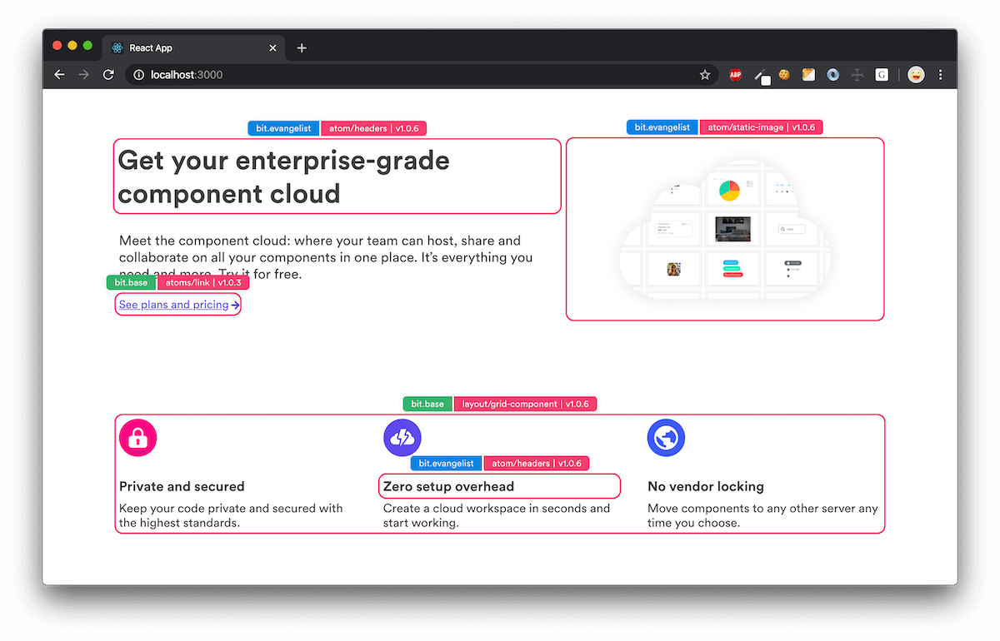
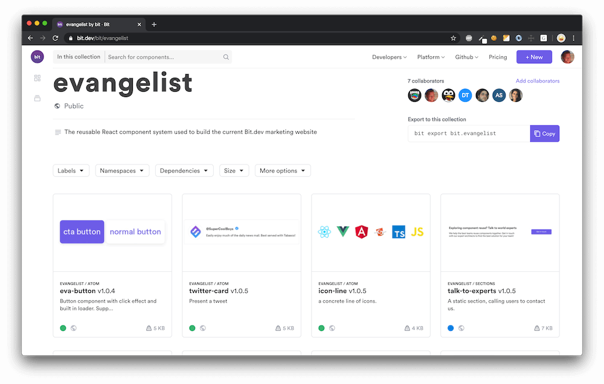

# Evangelist - Marketing components of [bit.dev](https://bit.dev)

This repo is a **component-based micro-frontend** with a set of independently-useful React components, which are [exposed as a Bit component collection](https://bit.dev/bit/evangelist) and then integrated into the bit.dev platform and website (alongside other components such as [base-ui)](https://github.com/teambit/base-ui).

## Component collection - choose and use

All components in this frontned codebase were [contained and exposed using Bit](https://github.com/teambit/bit) as a set of independently-usable components. See the **[Enavgalist collection on bit.dev](https://bit.dev/bit/evangelist)** to explore and integrate any component into your project.

- Install independent component with npm/yarn.
- Use `bit import` to source and edit components locally for quick integration. Keep getting managed updates.
- Try any component hands-on in a live playground.

Note: Some components are generic  and may be 'upgraded' to _bit.base_ (I'm looking at you, [eva-button](https://bit.dev/bit/evangelist/atom/eva-button)).

## Key components

### Pages
full pages with margins, backgrounds. Because of its size, _Page_ components should not contain granular content, and only set the layout for individual sections.

### Sections
Individual areas containing most of the content, and can be reused between pages. Sections may occupy different spaces in different pages, so they should avoid sizing and backgrounds

### Content

Raw data objects for visual components (like MVC's model). A single ui component can use many _Content_ components at different places, and _Content_ may be presented differently in different ui components.

### Atom / 'concrete'
Components specific to this homepage. As atomic ui components, they are still abstract and should not contain texts and content.  

## Setup

1. Clone the repository
2. [Install bit](https://docs.bit.dev/docs/installation)
3. Run `yarn install` or `npm install` to install all packages.
4. Run `bit import` to sync components.
5. Start hacking!
